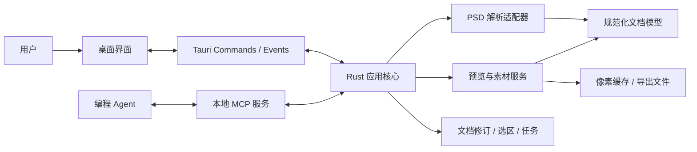

# 技术架构

## 结构与依赖

采用 Rust + Tauri。前端负责交互和展示，Rust 核心负责文档、选择、任务与设计数据；Tauri Commands 和 MCP 是访问同一核心能力的两种适配层。

| 模块           | 职责                                                     | 边界                                     |
| -------------- | -------------------------------------------------------- | ---------------------------------------- |
| 桌面界面       | 文档标签、图层树、画布、选择、属性与连接设置             | 不解析 PSD，不维护另一份权威业务状态     |
| 应用核心       | 协调加载、读取、选择、任务、导出和取消                   | 不依赖具体前端组件或 MCP 消息结构        |
| 文档与状态     | 文档注册表、活动文档、各文档选区、不可变修订、快照与任务 | 所有入口遵循同一版本和生命周期规则       |
| PSD 解析适配器 | 封装第三方解析库，转换为统一模型                         | 第三方类型不直接暴露给界面或 MCP         |
| 预览与素材     | 合成预览裁剪、按需解码、受支持效果导出                   | 显式报告能力与限制，不用截图冒充独立素材 |
| Tauri 适配层   | Commands 参数校验、事件与文件访问                        | 复用核心服务，不复制业务逻辑             |
| MCP 适配层     | 工具 Schema、响应包装与本地传输                          | 复用核心服务，不持有独立解析会话         |

这些是逻辑模块，具体 crate 和目录拆分在工程初始化时确定，不要求每个模块单独建包。

## 选型策略

| 领域     | 方向                             | 验证重点                                               |
| -------- | -------------------------------- | ------------------------------------------------------ |
| 桌面容器 | Tauri，具体版本在初始化时锁定    | Windows 开发与打包、文件读取、图像展示和事件通信       |
| 界面     | Vue + TypeScript 为候选          | 画布交互、图层树规模、状态订阅与类型协作               |
| PSD      | `ag-psd-rs` 为优先候选           | 真实样本的文字、分段样式、变换、像素与效果完整性       |
| MCP      | 官方 Rust SDK `rmcp` 为候选      | 工具结构化输出、图像返回、Streamable HTTP 与客户端互通 |
| 图像展示 | 原稿合成图优先，界面叠加选择边界 | 尺度、色彩与边界对齐；大图展示内存开销                 |

解析器通过适配层隔离。候选无法达到首版要求时，记录差异与样本结果，再决定补充实现或替换；首版不默认同时维护多套生产解析器。

## 多文档状态

核心维护已打开文档注册表、标签顺序和可空的 `activeDocumentId`。每个文档独立保存当前修订及选区；界面按 `documentId` 保存缩放、平移和图层树展示状态，当前工具则属于应用级状态。

切换标签时，核心原子更新活动文档及对外选区摘要，界面恢复对应视图；后台文档不因暂时不可见而关闭。所有异步结果和界面事件携带文档 ID 与修订，防止晚到的属性或预览覆盖另一标签。

区域拖动草稿属于临时交互状态。按文档修订建立图层边界索引，为边缘吸附和区域查询复用；后台查询携带文档修订及草稿序号，过时结果不覆盖当前预览。提交时由核心校验最终矩形，固定完整命中集合并发布快照；鼠标移动不逐帧创建快照或推动 MCP 选择版本。

框外黑色半透明遮罩属于界面叠加层，只覆盖当前选框之外的画布，原稿图像持续显示，选区内部不受遮罩影响。遮罩跟随当前文档的选框预览或已提交范围，不修改图层可见性，不参与吸附、区域命中或设计样式计算。

打开前按规范化文件路径检查已打开和正在加载的文档，同一路径复用已有标签或加载请求，不使用文件名去重。关闭标签从已打开列表移除文档；任务或在途请求仍引用的修订由核心继续保留，最后一个标签关闭后 MCP 与任务服务仍可使用。完整生命周期见[选区与任务](04-选区与任务.md)。

## 文档加载与修订

1. 桌面端选择文件，核心校验格式与资源预算，在后台取得稳定、自包含的源字节或私有不可变副本。
2. 从同一份固定数据解析文档元数据、图层树、能力报告与可用的合成预览；后续位图按需解码也只使用这份数据。
3. 将成功结果作为该文档的不可变修订发布，加入文档注册表和标签栏，再按当前用户意图决定是否激活。
4. 通过 Tauri 事件通知界面；MCP 请求读取核心中的同一份状态。

加载失败不覆盖已有文档。不同文件的打开请求独立完成，成功结果均可成为标签；仅符合最新打开或切换意图的结果可以改变活动文档。同一文档的重载只接受最新有效请求，被取消的结果不能重新打开已关闭的标签。

读取或制作副本期间，须使用能阻止并发写入的读取策略，或经验证可检测变化的机制并重试，保证固定数据来自一致的文件版本。不能先解析源路径、事后再复制可能已变化的文件，也不能仅凭修改时间未变宣称读取一致。无法取得稳定版本时返回 `SOURCE_CHANGED`，保留已有修订；原型须覆盖外部程序并发原地写入和原子替换两类情况。

源文件变化不会静默改写已发布的修订。显式重新加载成功后生成新修订并清空该文档选区，不按图层名称迁移选择；后台重载不自动激活标签。旧任务继续读取原修订的数据，生命周期见[选区与任务](04-选区与任务.md)。

## 并发、缓存与通信

- 文档修订不可变并可共享引用，选区和任务索引由核心同步修改。锁只保护状态读取与提交，不跨越解析、解码或文件写入。
- 设计读取在请求开始时固定其文档与范围，导出作业在接受时固定独立引用；各次响应组装时另取最新选区。业务范围与实时选区允许指向不同文档，导出结果查询也不以当前选区替换作业范围。
- 长耗时工作使用有界后台任务与取消信号，限制并发解码数量。取消与结果提交由核心确定先后顺序；取消被接受后不再发布新的成功结果，已发布的完整结果保留，临时文件按作业归属清理。
- 缓存键包含文档修订、图层或范围、输出比例及渲染选项。任务固定原始数据和范围，不强制把所有解码像素常驻内存。
- 多个文档共享进程级资源预算；优先回收可重新生成的后台图像缓存，保留各文档选区与任务引用。关闭标签后按剩余引用释放资源，不能因内存紧张静默改变任务范围。
- 对图层列表分页，只传输界面或 Agent 所需字段。图像通过受控本地资源或协议图像内容提供，不在每次 JSON 响应中重复嵌入整页位图。
- 选区返回包含预算内的区域图层、文字及关键样式，完整命中集合固定在快照中。首批内容可按快照、字段投影和响应预算缓存，各工具复用；响应组装先固定选区快照引用，再读取其内容，不能混入更新后的选区数据。
- 响应预算分别为业务结果和当前选区首批内容预留空间，并计入协议兼容文本与图像；各部分独立分页。具有副作用的请求在执行前检查最小回执和选区首批能否容纳，不能先创建任务或写出文件，再因响应预算不足丢失结果引用。
- Rust 定义边界 DTO，前端与 MCP Schema 通过生成或一致性检查维护；不依赖手工复制三套类型。

## 导出作业

导出作业独立于保存设计范围的 `DesignTask`，具有 `exportId`、客户端请求 ID、固定的文档修订与范围、导出参数、导出根目录及状态。核心预留执行、结果记录和响应所需预算后注册作业；资源不足时在产生副作用前拒绝。相同请求 ID 与相同参数在同一会话中返回同一作业，重试不重复写文件；不同参数返回冲突。

作业状态为 `running`、`completed`、`partial`、`failed` 或 `cancelled`。运行中返回作业标识、状态、固定范围与根目录、进度及建议查询间隔，不返回未定稿清单或结果游标；终态保存全部规范化输出项的成功、失败或取消信息。全部素材输出成功且清单发布成功时为 `completed`；至少一个素材成功、但有素材输出或清单发布失败时为 `partial`；没有成功素材且作业失败时为 `failed`。取消先于完成被接受时优先采用 `cancelled`，保留此前已发布成功项，未完成项记录取消原因。

终态清单尝试独立落盘，并记录发布状态；发布失败时保留完整逐项记录供分页查询，不能以汇总错误覆盖成功素材。素材失败计数只统计规范化输出项，不将清单发布失败伪造为素材失败项。`partial` 布尔值表示至少一个素材成功且作业未完全成功，包含清单发布失败或取消的情况，不等同于分页截断。清单字段见[PSD 数据与素材](03-PSD数据与素材.md)，查询与清单发布失败的响应规则见[MCP 与 Agent 协作](05-MCP与Agent协作.md)。

连接断开不自动取消已接受的导出，用户可从桌面明确取消。核心统一裁决取消、单项发布和作业完成的先后顺序，完成后的取消不改写终态。作业固定的数据引用保护在途导出，不因任务释放而丢失；终态后释放计算所需引用。结果记录在当前会话内保留并受有界准入控制，不能为接纳新作业而静默丢弃旧作业的恢复入口。已发布文件不随任务释放删除；首版不承诺重启后恢复作业，清理导出文件属于用户独立操作。

## 本地服务与文件边界

首版在桌面进程内提供 Streamable HTTP MCP。应用启动后按连接设置启用监听，应用退出后停止服务；同一服务访问同一个 Rust 核心。只支持 stdio 的客户端后续可使用桥接进程，桥接进程只转发请求。

- 监听回环地址，使用实例凭据并校验适用的 Host／Origin；不默认开放局域网访问。
- 连接配置显示实际地址和凭据配置方式；端口冲突时明确报错或更新实际地址，不能展示失效配置。
- PSD 文件以只读方式打开，核心不提供设计内容编辑或保存回写接口；桌面端和 MCP 均遵守这一边界，选择、视图和任务属于应用状态。
- MCP 首版访问已打开文档或既有任务保留的快照，不接受任意文件路径来打开 PSD。
- 导出由桌面配置的根目录约束。每个作业在接受时固定受控的绝对根目录，设置改变只影响新作业；核心生成作业子目录及文件名，规范化路径并拒绝越界，不让图层名称或 Agent 参数直接决定任意写入位置。结果返回该作业的 `exportRoot` 和文件 `relativePath`，使同一文件系统中的 Agent 能准确定位素材；实际访问路径由两者连接后校验，不能越出该根目录。
- 日志记录操作、版本、耗时和错误；默认不写入完整 PSD 文字、像素或连接凭据。

## 故障隔离与诊断

格式限制、损坏文件、资源不足、取消和导出失败使用可识别的领域错误，适配层将其映射为界面提示或 MCP 工具错误。局部图层解码失败不应使已解析的文档信息整体不可读。

记录解析、规范化、解码、裁剪、导出和请求响应各阶段耗时，以及缓存占用和峰值内存。性能预算在原型实测后制定，不能以 Rust 技术选型代替性能验证。

Codex 专属会话控制独立于核心与通用 MCP，见[MCP 与 Agent 协作](05-MCP与Agent协作.md)。
