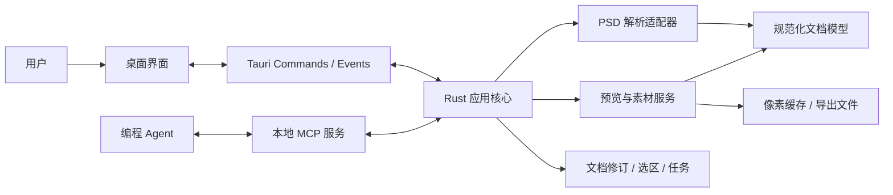

# 技术架构

## 结构与依赖

采用 Rust + Tauri。前端负责交互和展示，Rust 核心负责文档、选择、任务与设计数据；Tauri Commands 和 MCP 是访问同一核心能力的两种适配层。

| 模块           | 职责                                   | 边界                                     |
| -------------- | -------------------------------------- | ---------------------------------------- |
| 桌面界面       | 图层树、画布、选择、属性与连接设置     | 不解析 PSD，不维护另一份权威业务状态     |
| 应用核心       | 协调加载、读取、选择、任务、导出和取消 | 不依赖具体前端组件或 MCP 消息结构        |
| 文档与状态     | 不可变文档修订、当前选区、快照与任务   | 所有入口遵循同一版本和生命周期规则       |
| PSD 解析适配器 | 封装第三方解析库，转换为统一模型       | 第三方类型不直接暴露给界面或 MCP         |
| 预览与素材     | 合成预览裁剪、按需解码、受支持效果导出 | 显式报告能力与限制，不用截图冒充独立素材 |
| Tauri 适配层   | Commands 参数校验、事件与文件访问      | 复用核心服务，不复制业务逻辑             |
| MCP 适配层     | 工具 Schema、响应包装与本地传输        | 复用核心服务，不持有独立解析会话         |

这些是逻辑模块，具体 crate 和目录拆分在工程初始化时确定，不要求每个模块单独建包。

## 选型策略

| 领域     | 方向                             | 验证重点                                               |
| -------- | -------------------------------- | ------------------------------------------------------ |
| 桌面容器 | Tauri，具体版本在初始化时锁定    | Windows 开发与打包、文件读取、图像展示和事件通信       |
| 界面     | Vue + TypeScript 为候选          | 画布交互、图层树规模、状态订阅与类型协作               |
| PSD      | `ag-psd-rs` 为优先候选           | 真实样本的文字、分段样式、变换、像素与效果完整性       |
| MCP      | 官方 Rust SDK `rmcp` 为候选      | 工具结构化输出、图像返回、Streamable HTTP 与客户端互通 |
| 图像展示 | 原稿合成图优先，界面叠加选择边界 | 尺度、色彩与边界对齐；大图展示内存开销                 |

解析器通过适配层隔离。候选无法达到首版要求时，记录差异与样本结果，再决定补充实现或替换；首版不默认同时维护多套生产解析器。

## 文档加载与修订

1. 桌面端选择文件，核心校验格式与资源预算，在后台读取文档。
2. 解析得到文档元数据、图层树、能力报告与可用的合成预览；位图按需解码。
3. 将成功结果作为不可变修订发布，再更新活动文档和选区。
4. 通过 Tauri 事件通知界面；MCP 请求读取核心中的同一份状态。

加载失败不覆盖已有文档。并发打开文件时，仅最新有效加载请求可以切换活动文档；被取消或被替代的结果不得晚到覆盖新文档。

源文件变化不会静默改写已发布的修订。首版通过显式重新加载生成新修订，并确保旧任务读取的是原修订的数据；生命周期见[选区与任务](04-选区与任务.md)。

## 并发、缓存与通信

- 文档修订不可变并可共享引用，选区和任务索引由核心同步修改。锁只保护状态读取与提交，不跨越解析、解码或文件写入。
- 请求开始时固定其文档与任务引用，计算完成后在响应组装时另取最新选区；业务结果与实时选区允许指向不同文档。
- 长耗时工作使用有界后台任务与取消信号，限制并发解码数量。取消后不发布完成状态，临时文件按作业归属清理。
- 缓存键包含文档修订、图层或范围、输出比例及渲染选项。任务固定原始数据和范围，不强制把所有解码像素常驻内存。
- 对图层列表分页，只传输界面或 Agent 所需字段。图像通过受控本地资源或协议图像内容提供，不在每次 JSON 响应中重复嵌入整页位图。
- Rust 定义边界 DTO，前端与 MCP Schema 通过生成或一致性检查维护；不依赖手工复制三套类型。

## 本地服务与文件边界

首版在桌面进程内提供 Streamable HTTP MCP。应用启动后按连接设置启用监听，应用退出后停止服务；同一服务访问同一个 Rust 核心。只支持 stdio 的客户端后续可使用桥接进程，桥接进程只转发请求。

- 监听回环地址，使用实例凭据并校验适用的 Host／Origin；不默认开放局域网访问。
- 连接配置显示实际地址和凭据配置方式；端口冲突时明确报错或更新实际地址，不能展示失效配置。
- MCP 首版访问已打开的文档，不接受任意文件路径来打开 PSD，也不修改用户设计文件。
- 导出由桌面配置的根目录约束。核心生成任务子目录及文件名，规范化路径并拒绝越界，不让图层名称或 Agent 参数直接决定任意写入位置。
- 日志记录操作、版本、耗时和错误；默认不写入完整 PSD 文字、像素或连接凭据。

## 故障隔离与诊断

格式限制、损坏文件、资源不足、取消和导出失败使用可识别的领域错误，适配层将其映射为界面提示或 MCP 工具错误。局部图层解码失败不应使已解析的文档信息整体不可读。

记录解析、规范化、解码、裁剪、导出和请求响应各阶段耗时，以及缓存占用和峰值内存。性能预算在原型实测后制定，不能以 Rust 技术选型代替性能验证。

Codex 专属会话控制独立于核心与通用 MCP，见[MCP 与 Agent 协作](05-MCP与Agent协作.md)。
